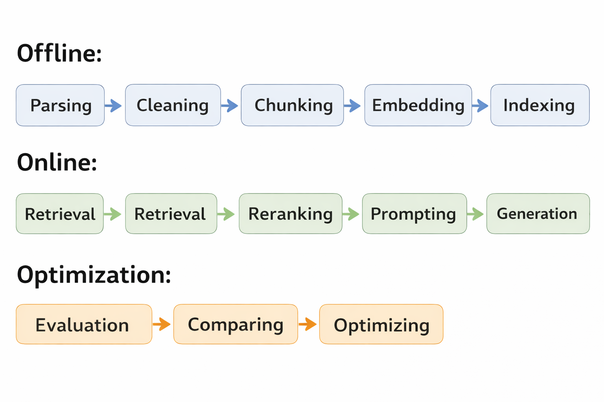
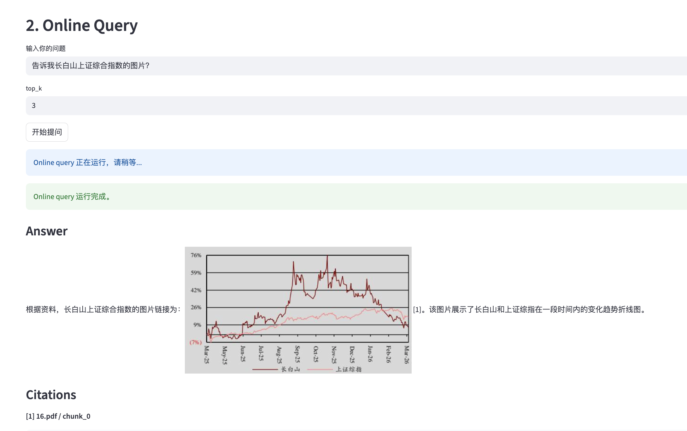

# Financial RAG Project

## Introduction
· A RAG-based information retrieval system for financial research reports.  
· It improves how large language models handle images and tables in the RAG pipeline.
· This project demonstrates a complete pipeline from raw PDF parsing to storage and retrieval.  
· It integrates external tools such as MinerU, Milvus, and LLMs. 
## Pipeline
 
 
## Structure
- src/   main source code

- docs/  interpretation of code
- README.md 
- 
1.Offline: 
1.0.Uploading
- src/offline/upload.py    
该文件用于将本地文件上传到对象存储的MINIO中  
```bash
python -m src.offline.upload data/raw/test0403/11.pdf
```

1.1. Parsing  
- src/offline/ParsingAndImageRenew.py   
该文件可将在MINIO bucket/input中的pdf文件进行mineru解析
并将生成的image地址替换为可访问的http格式
```bash
python -m src.offline.parsing_and_imagepath_renew --pdf 11.pdf
```

1.2. Cleaning
- src/offline/describe_image_byvlm.py
该文件在具有http路径的图片下，调用vlm生成对图片的理解
```bash
python -m src.offline.describe_image_byvlm --pdf 11.pdf
```

1.3. Chunking
-src/offline/chunking.py   
将minio上的md文件进行合并与切分
```bash
python -m src.offline.chunking --pdf 11.pdf --chunk_size 400 --overlap 80
```

1.4. Embedding
-src/offline/embedding.py
将minio上的._chunks.json文件 使用线上embedding模型生成._embedding.json
```bash
python -m src.offline.embedding --pdf 11.pdf
```

1.5. Indexing
-src/offline/indexing.py
链接milvus, 将._embedding.json 存入并生成索引
```bash
python -m src.offline.indexing --pdf 11.pdf
```
2.Online:
2.0 query
-src/online/query.py
该文件用于输入问题并进行embedding,并链接milvus找到相似的top-k的chunk
```bash
python -m src.online.query --query "今年相对上证指数是多少？" --top_k 3
```
2.1. Retrieval  
2.2. Reranking  
2.3. Prompting  
2.4. Generation  
2.5. Citation  

3.Optimization
3.1. Evaluation  
3.2. Comparing  

